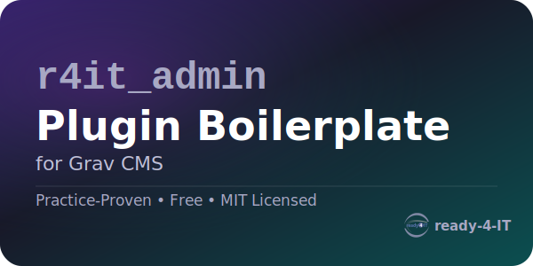

<!--
r4it_admin-plugin_boilerplate_grav
@category Grav_Plugin
@author Nejat P. Eryigit <https://www.ready-4-it.com>
@copyright 2026 Nejat P. Eryigit
@license https://opensource.org/licenses/MIT MIT License
@link https://github.com/timejunky/r4it_admin-plugin_boilerplate_grav
-->

# r4it Admin Plugin Boilerplate (Grav)

This is a minimal **Method 2 (GrayGate-style)** admin tool-page boilerplate.

- Adds an Admin sidebar entry via `onAdminMenu()`.
- Provides a robust, language-prefix-safe Admin tool route via `onTwigSiteVariables()`.
- Renders a tabbed Twig UI using the normal Admin pipeline.

Default route:
- `/admin/r4it-admin-plugin-boilerplate` (also works with language prefix like `/de/admin/r4it-admin-plugin-boilerplate`)

## Support (MIT Community Edition)

- For support, please use Grav community channels and this repository's public GitHub issues/discussions.
- This MIT/community edition does not include private 1:1 support.

## Internationalization (i18n)

Supported admin locales:

- en
- de
- fr
- pt
- tr
- lb

Locale files are stored separately in the languages directory:

- languages/en.yaml
- languages/de.yaml
- languages/fr.yaml
- languages/pt.yaml
- languages/tr.yaml
- languages/lb.yaml

How to add a new locale:

1. Copy languages/en.yaml to languages/<locale>.yaml.
2. Keep the same key structure under PLUGIN_R4IT_ADMIN_PLUGIN_BOILERPLATE.
3. Translate values only, not keys.
4. Purge Grav cache so changes are visible in Admin.

## Documentation and Resources

- [ARCHITECTURE.md](ARCHITECTURE.md) - Technical blueprint, GrayGate pattern, request flow, and extension points.
- [CONTRIBUTING.md](CONTRIBUTING.md) - How to report issues and contribute improvements.
- [CHANGELOG.md](CHANGELOG.md) - Project history in Keep a Changelog format.
- [SECURITY.md](SECURITY.md) - Private vulnerability disclosure process.

## Branding Asset

- Canonical logo for this product: `admin/assets/logo.svg`
- Use this logo in product-related pages and materials where branding is needed.
